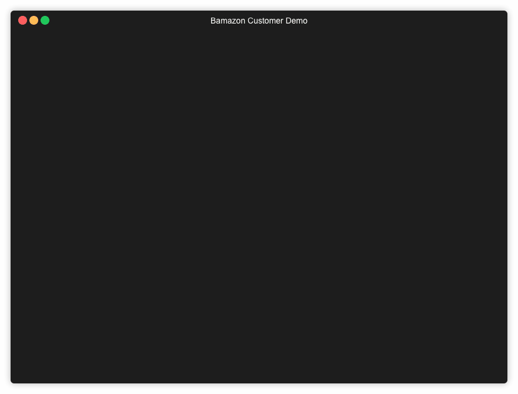
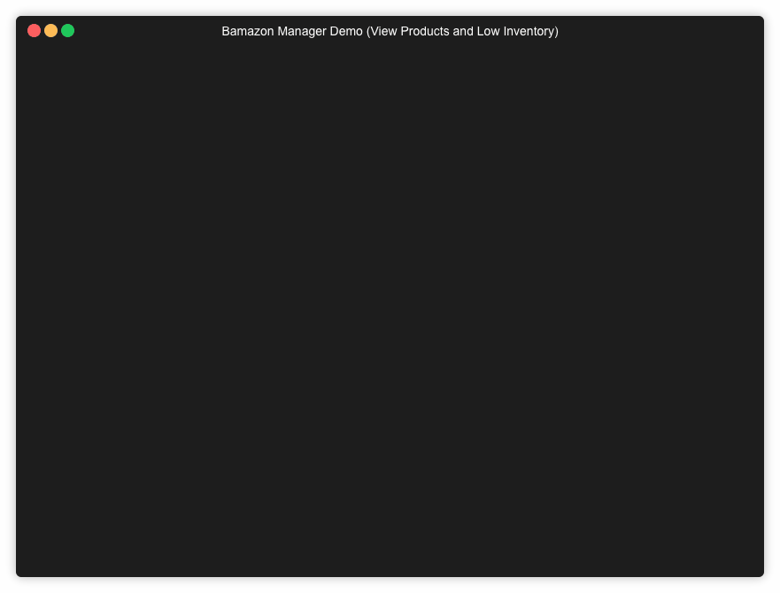
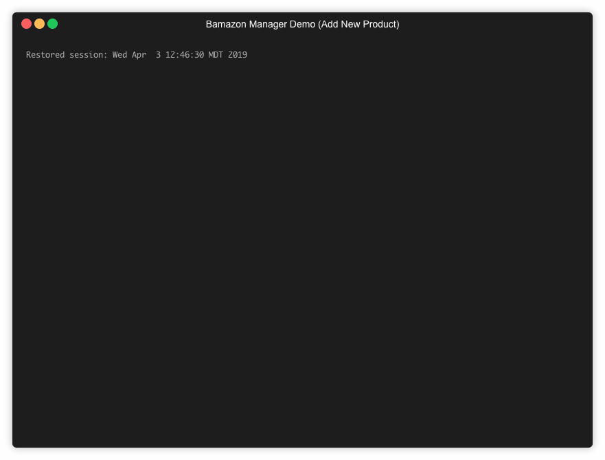

# bamazon-node-mysql

## Overview:

Bamazon is a simulated online marketplace that runs on the command line using Node.js. Bamazon application comes with customer and manager interfaces, The customer can order items from bamazon and the manager can restock items and add new items for sale.

---

## Getting Started
1. Clone the repository.
2. Run command `npm i` in Terminal.
3. Set up MySQL database. Create the bamazon database used the SQL code in the file bamazon.sql.
4. Choose an interface below.

### Customer

To use the customer interface, type `node bamazonCustomer.js` in Terminal.

The customer interface takes in orders from customers. If inventory is available, it will calculate the total cost for the customer and deplete the stock from the store's inventory. If inventory is not available, the app will alert the customer. 

### Manager

To use the manager interface, type `node bamazonManager.js` in Terminal.

The manager interface allows the user to:
1. View Products for Sale 
2. View Low Inventory (Shows all products with a quantity 5 or less)

3. Add to Inventory (Takes current inventory and updates quantity)

4. Add New Product (Create and add new entry to the mySQL database)

---

## Built with:

- [JavaScript](https://developer.mozilla.org/en-US/docs/Web/JavaScript) - High-level programming language
- [Node.js](https://nodejs.org/en/) - Open-source run-time environment that executes JS code outside of a browser
- [JSON](http://www.json.org) - Data format
- [MySQL](https://www.mysql.com) - Database
- [Sequel Pro](https://www.sequelpro.com) - Mac database management application for working with MYSQL database
- [MAMP](https://www.mamp.info/en/) - Access to local PHP server and MYSQL server
- [Visual Studio Code](https://code.visualstudio.com/) - source code editor developed by Microsoft

#### npm packages used:

- [inquirer](https://www.npmjs.com/package/inquirer) - A collection of common interactive command line user interfaces
- [mysql](https://www.npmjs.com/package/dotenv) - Node.js driver for MySQL

---

#### Check me out on LinkedIn!

https://linkedin.com/in/matthewrhopkins/
